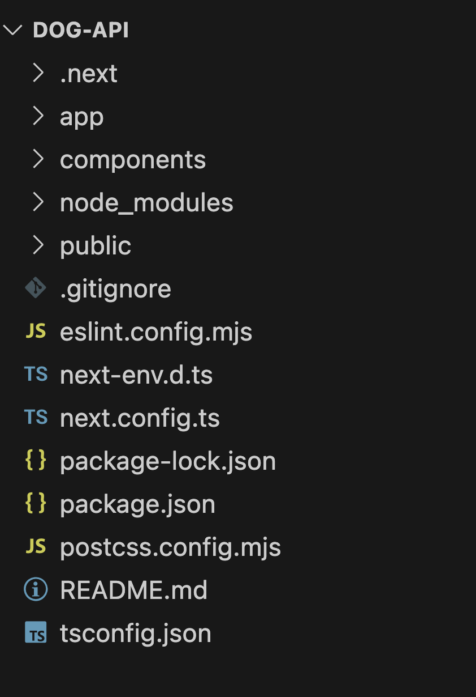

# Galeria de Cachorro


---

### Sobre o projeto:
* Criar uma galeria web com fotos de cachorros, utilizando a DogAPI. Utilizar o framework next.js. Essa tecnologia facilita o processo de desenvolvimento da aplicação.

---

### Metodologia
1. Instalação do Node.js, no mínimo versão 16
2. Instalação do Next.JS. Utilizando o comando:
```bash 
npx create-next-app@latest nome-app
```
3. Inicializar a framework, utilizando:
```bash 
cd nome-app 
npm run dev
```
4. Abra o endereço mostrado no terminal (geralmente `http://localhost:3000`).
5. Criação de componentes para facilitar a programação. Contendo toda a programação JS e organização da tela
6. Editar o arquivo globals.css, que é aplicado o estilo geral da aplicação Web e o pages, tela inicial 

---

### Estrutura utilizada



---

### Consumo API 
* Endpoint da DogAPI

    ```GET https://dog.ceo/api/breed/{raca}/images```

* Retorna um array de imagens dos animais

```bash
"use client";
import { useState } from "react";
// useState -> utilizada como uma Div moldável, para alterar o conteúdo dentro

export default function DogGallery() {
  const [fotos, fotosDog] = useState([]);
  const [carregando, carregandoApi] = useState(true); //Caso esteja true, ele mostra a mensagem de carregando

  // Pesquisar raça na API, e receber resultados
  async function pesquisarDogs(raca) {
    try {
        const resp = await fetch(`https://dog.ceo/api/breed/${raca}/images`); // Fazer requisição API
        const data = await resp.json(); //Resposta da API
        return(data.message)
      
    } catch (e) {
        console.error("404- Raça não encontrada"); // Erro csso não encontre a raça
    }
  }

  // Função preencher tela com as fotos
  async function preencherDogs() {
    try {
        carregandoApi(true)
        const raca = document.getElementById('inputRaca').value //Recebe o valor digitado
        const listaFotos = await pesquisarDogs(raca) // Pega a resposta da API

        fotosDog(listaFotos); //Coloca as fotos no container

    } catch (e) {
        console.error("404- Erro ao carregar fotos");
    } finally {
        carregandoApi(false); // Apresenta as fotos e some a mensagem de carregando
    }
  }
  ```


---


### Tecnologias utilizadas
<li> Next.JS</li>
<li> Node.JS</li>
<li> HTML</li>
<li> CSS</li>
<li> Markdown</li>
<li> Git</li>
<li> GitHub</li>

---

### Apresentação e documentação do Next

* [Apresentação Canva](https://www.canva.com/design/DAGwERDoaxE/j4ciSxE733dV-SqEmXg4WA/edit?utm_content=DAGwERDoaxE&utm_campaign=designshare&utm_medium=link2&utm_source=sharebutton)
* [Documentação Next.JS](https://nextjs.org/docs)

---

### Render
Acesse nosso projeto através de [Dog-API](https://dog-api-next.onrender.com) 

---


### Autores
- [Eduarda de Jesus](www.linkedin.com/in/eduarda-silva-4aa274331)
- [Isabelly Lima](https://www.linkedin.com/in/isabelly-silva-a02952322/)
- [Laura Sofia](https://www.linkedin.com/in/laura-sofia-0a5b06326/)
- [Letícia Souza](linkedin.com/in/leticia-souza-almeida-84712a2b5)


